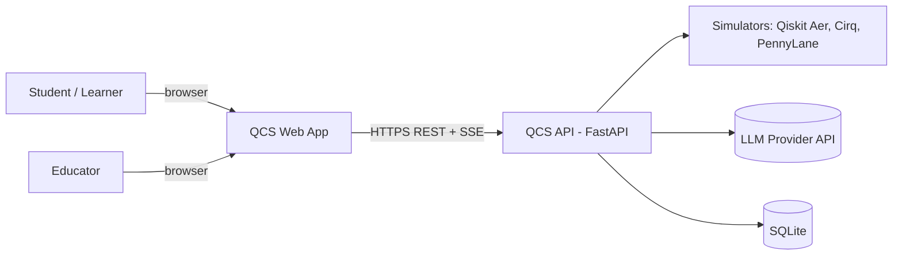
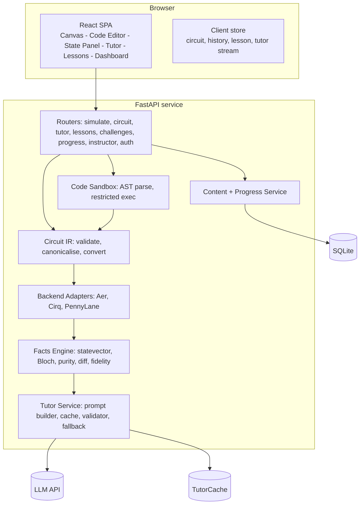
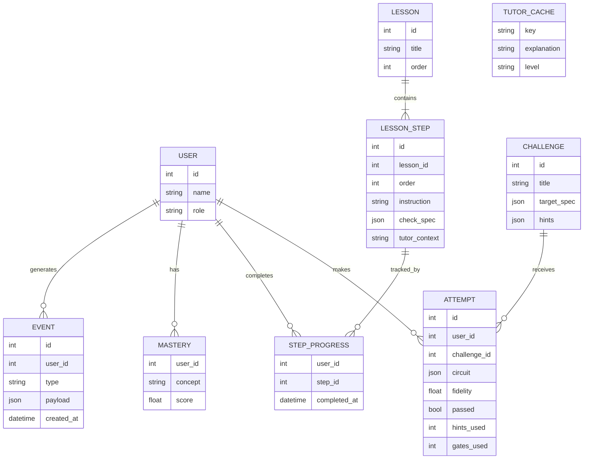
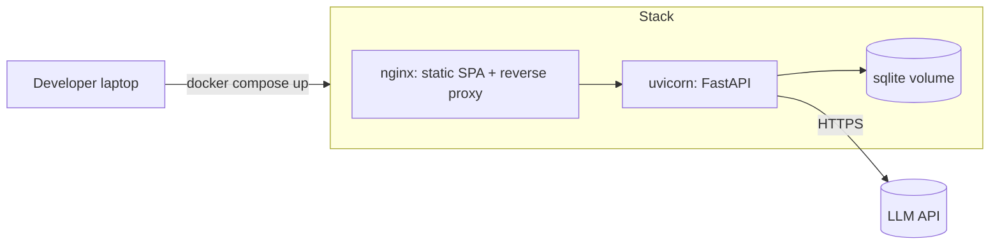

# System Architecture

**System:** Quantum Circuit Sandbox with a Live AI Tutor (QCS) | SIH26140 | Team LUNATICSS

Companion documents: `01_PRD.md`, `02_SRS.md`, `04_UIUX_Design.md`.

---

## 1. Architectural Principles

1. **One source of truth.** A canonical *Circuit JSON* drives canvas, code view, QASM export, every simulator and the tutor.
2. **Deterministic core, generative edge.** Physics (state, probabilities, Bloch, fidelity) is computed by Qiskit/NumPy. The LLM only *narrates* computed facts.
3. **Graceful degradation.** LLM down → template explanations. Cirq down → Aer only. Nothing blocks the live loop.
4. **Adapters at every boundary.** Simulators, LLM providers and storage sit behind interfaces.
5. **Small enough to finish in 2 days,** shaped so it can scale.

## 2. System Context



## 3. Container View



## 4. The Live Learning Loop (runtime sequence)

```mermaid
sequenceDiagram
  participant U as User
  participant C as Canvas (React)
  participant A as FastAPI
  participant B as Backend Adapter (Aer)
  participant F as Facts Engine
  participant T as Tutor Service
  participant L as LLM
  U->>C: Drop CNOT on q0->q1
  C->>C: Update Circuit JSON (+history)
  C->>A: POST /simulate {circuit, shots}
  A->>A: Validate IR
  A->>B: run(circuit)
  B-->>A: statevector, counts
  A->>F: compute probabilities, Bloch, purity, diff
  F-->>A: facts packet
  A-->>C: state + facts (renders bars, Bloch, diff)
  C->>A: POST /tutor/explain (SSE) {facts, action, step}
  A->>T: cache lookup (hash)
  alt cache hit
    T-->>C: stream cached text
  else miss
    T->>L: prompt(facts only)
    L-->>T: tokens
    T->>T: numeric validator vs facts
    alt valid
      T-->>C: stream text; store cache
    else invalid or timeout
      T-->>C: template explanation
    end
  end
```

Design note: the state response returns **first** (fast path, ~100–300 ms); the tutor stream follows independently so slow LLM calls never block visuals.

## 5. Component Design

### 5.1 Frontend (React + TypeScript + Vite)

| Module | Responsibility | Library choices |
|---|---|---|
| `CircuitCanvas` | Grid of 5 wires × N columns; drag/drop; selection; two-qubit gate linker | Custom SVG + `@dnd-kit/core` (simpler to control than a node-graph lib) |
| `GatePalette` | Gate tiles with tooltips | — |
| `CodeEditor` | Qiskit editing, error markers | Monaco Editor |
| `StatePanel` | Probability bars, amplitude table, diff highlight | Recharts or plain SVG |
| `BlochSphere` | Per-qubit 3D vector | three.js (or SVG 2.5D fallback) |
| `HistogramPanel` | Shot counts | Recharts |
| `TutorPanel` | Stream, chat input, "what the tutor saw" | SSE via `EventSource`/fetch stream |
| `LessonPlayer` | Steps, checks, progress | — |
| `ChallengePanel` | Target, hints, submit | — |
| `Dashboard` | Student progress; instructor table | — |
| `store/` | Circuit, history (undo/redo), ui, tutor, session | Zustand |
| `api/` | Typed client | Generated from OpenAPI |

State management: `circuit` (Circuit JSON) is the only mutable domain state; code text is *derived* (canvas → code) or *parsed* (code → circuit). Conflict rule: last edit source wins; parse errors keep the previous valid circuit and show markers.

### 5.2 Backend (FastAPI, Python 3.11)

```
backend/
  app/
    main.py                # app factory, CORS, routers
    routers/               # simulate.py circuit.py tutor.py lessons.py challenges.py progress.py instructor.py auth.py
    core/
      ir.py                # Pydantic models + validators for Circuit JSON
      convert.py           # IR <-> Qiskit QuantumCircuit <-> QASM <-> code text
      sandbox.py           # AST allow-list, subprocess runner
      backends/
        base.py            # Backend protocol: run(circuit, shots) -> Result
        aer.py             # Qiskit Statevector + AerSimulator
        cirq_adapter.py    # QASM -> Cirq -> simulate
        pennylane_adapter.py  # stretch
      facts.py             # probabilities, amplitudes, Bloch, purity, diff, fidelity
      optimize.py          # redundancy detection (+ transpile diff)
    tutor/
      prompts.py           # templates, level variants, safety rules
      service.py           # cache, LLM call, streaming, timeout
      validator.py         # numeric grounding check
      fallback.py          # deterministic explanations per gate/state pattern
      llm/                 # provider adapter(s)
    content/
      lessons.json  challenges.json
    db/
      models.py  session.py  seed.py
  tests/
```

### 5.3 Circuit IR
Pydantic model `Circuit{version, num_qubits, gates[]}` with the validation rules in SRS §4.2. `convert.py` provides:
- `to_qiskit(circuit) -> QuantumCircuit` (gates sorted by `column`).
- `to_code(circuit) -> str` (canonical `qc.h(0)` style lines).
- `from_code(text) -> (circuit | errors)` using Python `ast`: walks statements, accepts `QuantumCircuit(n[, m])` and calls to supported methods with integer literals (loops over `range` with literal bounds are unrolled). Anything else → unsupported-subset report.
- `to_qasm(circuit)` via Qiskit's QASM exporter.

### 5.4 Facts Engine (the trust anchor)
Inputs: `QuantumCircuit` (measurements stripped for state analysis).
Outputs:
- `Statevector.from_instruction(qc)` → amplitudes, probabilities (`|α|²`).
- For each qubit `k`: `ρ_k = partial_trace(state, all except k)`; Bloch `(tr ρX, tr ρY, tr ρZ)`; purity `tr ρ²`; entangled if purity < 1 − 1e‑6.
- Diff vs previous probabilities (added/removed/changed basis states).
- Challenge fidelity `|⟨target|ψ⟩|²`.
- Shots: `AerSimulator` with measurements → counts.

Everything here is pure and unit-tested with golden cases (|+⟩, Bell, GHZ, X on q1 for bit order).

### 5.5 Backend Adapters

```python
class Backend(Protocol):
    name: str
    def run(self, circuit: Circuit, shots: int) -> BackendResult: ...
    # BackendResult: probabilities: dict[str, float], counts: dict[str, int] | None, statevector: list[complex] | None
```
- **Aer (primary):** exact statevector + sampled counts.
- **Cirq:** `to_qasm` → `cirq.contrib.qasm_import.circuit_from_qasm` → `cirq.Simulator`. Reorder bitstrings to match Qiskit convention before comparison.
- **PennyLane (stretch):** `qml.from_qasm` (or build via qnode) → `default.qubit`.
- **Comparison service:** total variation distance between probability dicts; UI shows "Backends agree ✓" if < threshold.

### 5.6 Tutor Service

**Prompt structure** (provider-agnostic):
```
SYSTEM: You are a quantum computing tutor for {level} learners. Rules:
 1) Use ONLY the numbers in FACTS. 2) 2-4 sentences. 3) Explain the gate's effect, then the state. 
 4) Never claim real hardware. 5) If asked something unrelated, redirect to the circuit.
FACTS (JSON): {...facts packet...}
LESSON CONTEXT: {step goal}
USER ACTION: {action}
```
**Pipeline:** build facts → cache lookup → LLM stream (timeout 6 s) → buffer for numeric validation (validate per sentence as it streams; if any sentence fails, cut over to fallback text) → store in cache.
**Cache key:** `sha256(canonical(prev_circuit) + canonical(action) + level + step_id)`.
**Fallback:** rule table keyed by (gate, pre-state pattern, post-state pattern): e.g., `H on |0⟩ → "H rotates |0⟩ to an equal superposition: P(0)=P(1)=0.50."` with numbers filled from facts.
**Free-text Q&A:** same grounding, plus last 5 actions and lesson step; injection hygiene: user text is wrapped and labelled as untrusted data; output is rendered as escaped markdown.
**Debug/Optimise/Codegen (stretch):**
- Debug: sandbox error → structured error (type, line, message) → tutor explains + proposes a fix (fix is re-validated by the parser before display).
- Optimise: `optimize.py` finds adjacent self-inverse pairs and `transpile(optimization_level=1)` diffs; tutor narrates a deterministic finding.
- Codegen: LLM output → `from_code` validation → load to canvas, or one retry, or show the error.

### 5.7 Code Sandbox
Two layers:
1. **Parse-only path (default, sync mode):** AST → IR. No code runs. Covers the supported subset and is fully safe.
2. **Exec path (code-only mode for advanced snippets):** AST allow-list (imports limited to `qiskit`, `numpy`, `math`), banned names (`open`, `exec`, `eval`, `__import__`, `os`, `sys`, `subprocess`, dunder attributes), run in a child process (`multiprocessing` + `resource` limits / container) with 2 s CPU and 256 MB memory, no network. Output limited to a serialised `QuantumCircuit` → IR-like result.

### 5.8 Content and Progress Service
Lessons/challenges seeded from JSON into SQLite. Step `check_spec` examples:
```json
{ "type": "probability", "qubit_state": "0", "target": {"0": 0.5, "1": 0.5}, "tol": 0.02 }
{ "type": "entangled", "qubits": [0, 1] }
{ "type": "fidelity", "target": "bell_phi_plus", "min": 0.99 }
```
Mastery update (rule-based): per concept (`superposition`, `entanglement`, `interference`, `basis_states`) `score = 0.6*score + 0.4*outcome` where `outcome ∈ {1 if first-try pass, 0.6 if pass with hints, 0 if fail}`. Next lesson = lowest-mastery unlocked concept.

## 6. Data Architecture


SQLite with WAL mode; SQLAlchemy ORM; Alembic optional.

## 7. API Contracts (key examples)

**`POST /api/simulate`**
```json
// request
{ "circuit": { "version":1, "num_qubits":2, "gates":[ {"id":"g1","type":"H","targets":[0],"controls":[],"column":0},
                                                      {"id":"g2","type":"CNOT","targets":[1],"controls":[0],"column":1} ] },
  "shots": 1024, "backend": "aer", "compare_with": "cirq" }
// response
{ "probabilities": {"00":0.5,"11":0.5},
  "amplitudes": {"00":{"re":0.7071,"im":0},"11":{"re":0.7071,"im":0}},
  "bloch": [ {"q":0,"x":0,"y":0,"z":0,"purity":0.5}, {"q":1,"x":0,"y":0,"z":0,"purity":0.5} ],
  "entangled_qubits": [0,1],
  "counts": null,
  "diff": {"changed": ["10→11"]},
  "backend_agreement": {"with":"cirq","tvd":0.0,"agree":true},
  "facts": { "...": "tutor facts packet" } }
```
**`POST /api/tutor/explain`** (SSE events: `token`, `done`, `fallback`, `error`).
**`POST /api/circuit/from-code`** → `{ "circuit": {...} }` or `{ "errors": [{"line":3,"code":"UNSUPPORTED_GATE","message":"..."}] }`.

Versioning: `/api/v1` prefix from day one; OpenAPI schema published at `/docs`.

## 8. Deployment


- `docker-compose.yml` with two services (web, api) and a volume for `qcs.db`.
- Env: `LLM_PROVIDER`, `LLM_API_KEY`, `LLM_MODEL`, `CORS_ORIGINS`, `SHOTS_DEFAULT`, `TUTOR_TIMEOUT_S`.
- Demo hosting options: local laptop (most reliable) and/or a single small cloud VM or PaaS for a public URL. Always keep a local fallback.

## 9. Security Architecture
- Secrets only server-side; `.env` not committed.
- Sandbox layers (parse-first, then restricted subprocess) for user code.
- Input validation via Pydantic on every endpoint; payload caps (circuit ≤ 200 gates, code ≤ 10 KB).
- Rate limiting (`slowapi`) on tutor and code endpoints.
- Prompt-injection controls: untrusted text delimited; LLM output is never executed; numeric validator; HTML escaped on render.
- Role-based access to instructor routes (token carries role).
- CORS restricted to the web origin.

## 10. Observability
Structured JSON logs (request id, route, latency); counters for cache hit rate, fallback rate, validator rejections, backend disagreements; `Event` table feeds instructor "top mistakes". Health endpoint `/healthz` includes simulator and LLM reachability.

## 11. Performance and Scaling Notes
- 5 qubits → 32 amplitudes: simulation is microseconds; latency is dominated by HTTP and LLM.
- Client debounce 400 ms on edits; cancel in-flight tutor streams when a new edit arrives (abort controller).
- Statevector memory doubles per qubit; the 5-qubit cap is a pedagogy choice as much as a compute one. Beyond ~20 qubits use MPS/tensor-network backends or GPU Aer.
- Scale-out path: stateless API replicas, PostgreSQL, Redis cache for tutor, background queue for heavy jobs, CDN for the SPA.

## 12. Key Technical Decisions (ADR summary)

| # | Decision | Alternatives | Rationale |
|---|---|---|---|
| 1 | Circuit JSON as IR | Use QASM or Qiskit object as source of truth | Easy to diff, validate, render, and version; QASM is export only |
| 2 | Server-side simulation with Qiskit | In-browser JS simulator | PS expects Qiskit/multi-SDK; consistent with code mode; 5 qubits is trivial server-side |
| 3 | LLM narrates computed facts | Let LLM compute state | Eliminates numeric hallucination; testable |
| 4 | Parse-first code sync | Always `exec` user code | Safe by construction for the supported subset |
| 5 | SSE for tutor streaming | WebSockets | Simpler, one-way, proxy-friendly |
| 6 | Custom SVG canvas | React Flow / node editor | Circuit grids are not node graphs; less friction |
| 7 | SQLite | PostgreSQL | Zero-ops for the prototype; ORM makes the swap easy |
| 8 | Cirq via QASM | Native Cirq circuit builder | One conversion path; adapters stay thin |

## 13. Repository Layout and Ownership

```
qcs/
  frontend/        (Dev A: canvas, editor, state panel)
  backend/         (Dev B: IR, backends, facts, routers)
  tutor+content/   (Dev C: prompts, fallback, validator, lessons)
  dashboard+ops/   (Dev D: DB, challenges, dashboard, docker, demo script)
  docs/            (these four documents + deck)
  docker-compose.yml  README.md
```

| Person | Day 1 | Day 2 |
|---|---|---|
| A — Frontend | Canvas, palette, undo/redo, state panel with bars | Bloch spheres, code editor sync UI, lesson/challenge UI |
| B — Backend | IR, converters, `/simulate`, Aer, facts engine | from-code/to-code, Cirq adapter, sandbox, tests |
| C — AI/Content | Facts → prompt, SSE, fallback table, cache | Validator, Q&A, lessons/challenges content, hints |
| D — Data/Integration | DB schema, seed, auth, CI/docker | Progress, instructor table, e2e test, demo script, deck |

Integration contract on Day 1 hour 1: freeze Circuit JSON and the `/simulate` + facts response shapes so A, B and C can work in parallel with mocks.
