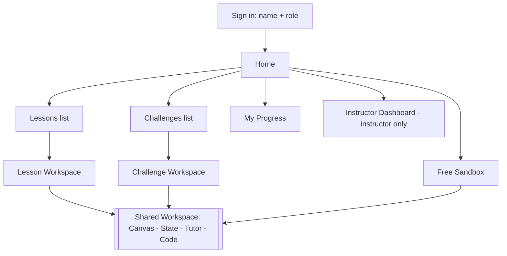

# UI/UX Design Specification

**Product:** Quantum Circuit Sandbox with a Live AI Tutor (QCS) | SIH26140 | Team LUNATICSS
Companion documents: `01_PRD.md`, `02_SRS.md`, `03_System_Architecture.md`.

---

## 1. Design Principles

1. **Cause and effect in one glance.** The action (circuit) and its consequence (state) are always visible together.
2. **Teach at the moment of confusion.** Explanations appear beside the thing that changed, not in a separate lesson page.
3. **Show the math only when asked.** Beginner view = plain language + visuals; Intermediate adds amplitudes/matrices.
4. **Safe to experiment.** Undo, reset, and clear error messages everywhere.
5. **Trust through transparency.** The tutor can show the facts it used; numbers always match the state panel.
6. **Calm, focused, accessible.** Low visual noise, WCAG AA, keyboard-first operation.

## 2. Users and Key Journeys

| Persona | Primary journey | Screens |
|---|---|---|
| Aarav (student) | Sign in → Lesson 1 → build circuit → read tutor → solve challenge | Home, Lesson Workspace, Challenge |
| Kabir (learner) | Open Sandbox → Code tab → compare backends → optimisation hint | Sandbox |
| Dr. Meera (educator) | Sign in → Dashboard → open a student → Demo mode | Dashboard, Sandbox (demo) |

## 3. Information Architecture


Top navigation: **Learn · Challenges · Sandbox · Progress · (Dashboard)** + profile menu + level toggle (Beginner/Intermediate).

## 4. Key Screens (wireframes)

### 4.1 Workspace (core screen, 1440×900 reference)

```
┌──────────────────────────────────────────────────────────────────────────────────────────┐
│ QCS  Learn  Challenges  Sandbox  Progress        Level: [Beginner▾]   Backend: [Aer▾]  👤 │
├───────────────┬──────────────────────────────────────────────┬───────────────────────────┤
│ LESSON 2      │  [Canvas] [Code]        ↶ ↷ ⟲  Shots [1024▾] │  STATE                    │
│ Entanglement  │ ┌──────────────────────────────────────────┐ │  Probabilities            │
│               │ │ q0 |0⟩ ──[H]────●──────[M]──              │ │  00 ████████████ 0.50     │
│ Step 3 of 5   │ │                 │                          │ │  11 ████████████ 0.50     │
│ ─────────     │ │ q1 |0⟩ ─────────⊕──────[M]──              │ │  Δ 10→11 highlighted      │
│ Add a CNOT    │ │ q2 |0⟩ ──────────────────                 │ │  Bloch                    │
│ with q0 as    │ │ q3, q4 (collapsed)                        │ │   (◎q0)  (◎q1)  ◎ short   │
│ control and   │ └──────────────────────────────────────────┘ │  = entangled badge        │
│ q1 as target. │  Gate palette: [H][X][Z][S][T][CNOT][CZ][M]  │  Amplitudes ▸ (expand)    │
│               │                                               │  Histogram ▸ (after M)    │
│ ☐ Step done   ├──────────────────────────────────────────────┴───────────────────────────┤
│ [Hint]        │ TUTOR ●                                                                   │
│               │ "CNOT flips q1 only when q0 is 1. Because q0 was in superposition, the    │
│ Progress 2/5  │  pair is now 00 or 11 with 50% each — they're entangled."   [What I saw ▸]│
│               │ Ask: [ Why did the Bloch arrows shrink?                        ] [Send]   │
└───────────────┴───────────────────────────────────────────────────────────────────────────┘
```
Layout logic: left rail = lesson/challenge context (collapsible); centre = canvas/code (primary); right = state (always visible); bottom = tutor strip (always visible, expandable to a chat drawer).

### 4.2 Code tab (same layout, canvas area replaced)

```
┌ Canvas | Code ─────────────────────────────────────────────┐
│  1  from qiskit import QuantumCircuit                      │
│  2  qc = QuantumCircuit(2, 2)                              │
│  3  qc.h(0)                                                │
│  4  qc.cx(0, 1)                                            │
│  5  qc.measure([0,1],[0,1])                                │
│ ───────────────────────────────────────────────────────── │
│ ✓ Synced with canvas (supported subset)   [Run] [QASM] [Copy]
│ ✗ Line 4: 'cz' needs two qubit arguments — [Explain error] │
└────────────────────────────────────────────────────────────┘
```
States: **Synced** (green), **Code-only mode** (amber: "uses features outside the canvas subset"), **Error** (red with line marker).

### 4.3 Challenge workspace
Same workspace; left rail shows the **target** (state preview + text), attempts, hint ladder (Hint 1 → 2 → 3), and **Check my circuit** button. Result banner: Pass (fidelity shown, gates used, score) or Not yet (what differs, e.g., "Your P(11) is 0.25; target is 0.50").

### 4.4 Home / Learn

```
Welcome, Aarav 👋             Continue: Lesson 2 · Entanglement (Step 3/5) [Resume]
┌ Lesson 1 ✓ ┐ ┌ Lesson 2 ▶ ┐ ┌ Lesson 3 🔒 ┐     Challenges: 1/3 solved
│ Superposition│ │Entanglement│ │Interference │     Recommended next: Interference
└──────────────┘ └────────────┘ └─────────────┘     [Open Sandbox]
```

### 4.5 Instructor Dashboard

```
Class: Quantum 101            Filters: [All lessons▾]   [Export CSV]
┌ Completion by lesson ──────────┐ ┌ Top mistakes ─────────────────────────────┐
│ L1 ██████████ 92%              │ │ 1. CNOT control/target swapped   (14)     │
│ L2 ██████░░░░ 61%              │ │ 2. Forgot Hadamard before CNOT   (9)      │
│ L3 ███░░░░░░░ 28%              │ │ 3. Challenge 3 hints ≥2          (11)     │
└────────────────────────────────┘ └───────────────────────────────────────────┘
Student        Lessons  Challenges  Last active   Status
Aarav S.       2/3      1/3         2 min ago     On track
Riya D.        1/3      0/3         3 days ago    ⚠ Stuck at L2·S3     [Open]
```

## 5. Component Specifications

| Component | Behaviour | States |
|---|---|---|
| **Gate tile** | Draggable; keyboard: focus + Enter to pick up, arrow keys to move, Enter to drop, Esc cancel | default, hover, dragging, disabled (e.g., after Measure) |
| **Wire cell** | Drop target; highlights valid/invalid | idle, valid-target, invalid-target |
| **Two-qubit gate** | After dropping CNOT/CZ, a second click chooses the partner qubit; vertical connector drawn; control = ●, target = ⊕ (CNOT) | placing, placed, error |
| **Probability bar row** | Label (bitstring), bar, value; changed rows pulse once | normal, changed, zero (dimmed) |
| **Bloch sphere** | Mini sphere per qubit; vector animates ≤400 ms; length <1 shows dashed inner sphere + "entangled" badge | pure, mixed/entangled, loading, reduced-motion (static) |
| **Tutor strip** | Streams text; shows "thinking" shimmer; badge when explanation is **template** ("offline tutor") | streaming, done, fallback, error |
| **Facts expander** | "What the tutor saw" → compact JSON table (probabilities, purity) | collapsed, expanded |
| **Hint ladder** | 3 hints, each reveals with confirmation; score penalty shown | locked, available, used |
| **Backend switch** | Aer / Cirq / Compare; "Backends agree ✓" chip with TVD on hover | single, comparing, disagree (amber) |
| **Undo/Redo/Reset** | Ctrl/Cmd+Z, Shift+Z; Reset asks confirmation if >3 gates | — |

### Interaction rules
- **Debounce:** simulate 400 ms after last edit; tutor explains only *committed* edits (drop/delete/move), not drag hover.
- **New edit cancels** any in-flight tutor stream.
- **Measure** is terminal: dropping a gate after M shows a tooltip "Measurement ends this wire" and blocks the drop.
- **Bit order:** small legend "q1q0 — qubit 0 is the right-most bit" under the probability chart, with a toggle.
- **Optimisation hint (stretch):** a soft badge on redundant gate pairs ("H·H cancels") — click to apply.

## 6. Visual Design System

### 6.1 Colour tokens
Aligned with the submission deck palette; dark-blue primary, colour-coded concepts.

| Token | Hex | Use |
|---|---|---|
| `--brand-navy` | `#1F497D` | headings, primary buttons, nav |
| `--brand-blue` | `#0070C0` | links, active tab, focus ring |
| `--accent-purple` | `#8064A2` | simulation / backend elements |
| `--accent-teal` | `#4BACC6` | state/visualisation highlights |
| `--accent-orange` | `#F79646` | tutor highlights, hints |
| `--accent-green` | `#77933C` | success, "synced", pass |
| `--danger` | `#C0504D` | errors |
| `--bg` / `--surface` | `#FFFFFF` / `#F5F7FA` | page / panels |
| `--text` / `--muted` | `#1A1A1A` / `#595959` | text (contrast ≥ 4.5:1 on white) |
| `--dark-bg` / `--dark-surface` | `#0F172A` / `#1E293B` | dark theme (optional) |

**Gate colour coding** (icon + letter, never colour alone): H = blue `#0070C0`, X/CNOT = purple `#8064A2`, Z/S/T (phase) = orange `#F79646`, CZ = teal `#4BACC6`, Measure = grey `#595959`.

### 6.2 Typography
- UI: **Inter** (fallback system-ui), body 14–16 px, line-height 1.5.
- Headings: 20/24/32 px, weight 600–700.
- Code & bitstrings: **JetBrains Mono** 13–14 px.
- Quantum notation (|0⟩, |ψ⟩, ⊕) uses Unicode; math in Intermediate mode via KaTeX.

### 6.3 Spacing, shape, elevation
4 px base grid (4/8/12/16/24/32). Corner radius 8 px cards, 6 px controls, circles for badges. Shadows: subtle (`0 1px 3px rgba(0,0,0,.12)`) for cards and dragged gates only. Visual motif: **numbered colour circles** (as in the deck) for lesson steps and progress.

### 6.4 Iconography
Lucide icon set; 20 px default, 1.5 px stroke.

### 6.5 Motion
- Bloch vector: ease-out, 300–400 ms.
- Probability bars: width transition 250 ms; changed-row pulse once.
- Tutor text: streams; no typewriter delay added beyond network.
- `prefers-reduced-motion`: replace animations with instant updates.

### 6.6 Tailwind tokens (snippet)
```js
// tailwind.config.js
theme: { extend: { colors: {
  navy:'#1F497D', brand:'#0070C0', purple:'#8064A2', teal:'#4BACC6',
  orange:'#F79646', green:'#77933C', danger:'#C0504D', surface:'#F5F7FA'
}, fontFamily: { sans:['Inter','system-ui','sans-serif'], mono:['JetBrains Mono','monospace'] } } }
```

## 7. Content and Microcopy

**Tutor voice:** friendly, concrete, short; explain gate → state → meaning. Avoid jargon without a one-line gloss.

| Situation | Example copy |
|---|---|
| After H on \|0⟩ | "H turns a definite 0 into an even mix: 50% chance of 0, 50% of 1. The arrow now points along the equator." |
| After CNOT creating Bell state | "CNOT flips q1 only when q0 is 1. Since q0 was in superposition, you now get 00 or 11 — 50% each. Neither qubit has a definite state alone, so the arrows shrank." |
| Invalid drop | "A qubit can't be both control and target. Pick a different wire." |
| Code error | "Line 4: `cx` needs two qubits, e.g. `qc.cx(0, 1)`." |
| Offline tutor | "Offline tutor · basic explanation" (badge, no apology text) |
| Challenge not yet | "Close! P(11) is 0.25 but the target is 0.50. Try adding a gate before the CNOT." |
| Off-topic question | "I'm best at questions about your circuit. Want to know why the state looks like this?" |
| Empty state | "Drag a gate onto a wire to begin. Try **H** on q0." |

Levels: **Beginner** hides amplitudes/phase by default and uses analogies; **Intermediate** shows amplitudes, phase degrees and small matrices (KaTeX).

## 8. Accessibility

- Contrast ≥ 4.5:1 for text, ≥ 3:1 for graphical objects.
- Every gate and wire has an accessible name ("Hadamard gate on qubit 0, column 2").
- Full keyboard workflow for placing, moving, deleting gates; visible focus ring (`--brand-blue`, 2 px).
- Charts have text equivalents: the probability table is always available; Bloch spheres expose x/y/z values as text.
- Tutor stream uses `aria-live="polite"`; errors `role="alert"`.
- No information by colour alone (shape/label always accompanies colour).
- Reduced-motion and larger-text support (layout tested at 200 % zoom).

## 9. Responsive Behaviour

| Breakpoint | Layout |
|---|---|
| ≥1280 px | Three-column workspace (as §4.1) |
| 1024–1279 px | Left rail collapses to a drawer; state panel stays visible |
| 768–1023 px (tablet) | Canvas on top, state and tutor as tabs below |
| <768 px (mobile) | Read-only viewer: lessons, progress, view circuit and state; editing shows "Use a larger screen to build circuits" |

## 10. Error, Empty and Loading States

| Case | UX |
|---|---|
| Simulation error | Inline banner in state panel with message; last valid state kept dimmed |
| LLM timeout | Template explanation + "offline tutor" badge; no blocking spinner |
| Network lost | Toast "Reconnecting…"; edits are queued locally |
| Code parse error | Red squiggle + line message; canvas unchanged |
| No attempts yet | Friendly prompt + example |
| Loading | Skeleton bars for state panel; tutor shimmer |

## 11. Demo Script (3 minutes) and Usability Checks

**Script:** (1) Drop H → probabilities + Bloch move, tutor explains. (2) Add CNOT → Bell state, arrows shrink, "entangled" badge. (3) Ask "Why did the arrows shrink?" → grounded answer with "What the tutor saw". (4) Type `qc.h(0)` in Code tab → canvas updates. (5) Solve Bell challenge → pass banner. (6) Switch to Compare → "Backends agree ✓". (7) Open Dashboard → class progress and top mistakes. (8) Kill network → offline tutor still works.

**Usability test plan (5 users, 10 min each):** think-aloud on Flow A; success = Bell state built unaided in <10 min; measure hint usage, misplacements of CNOT, and whether users can explain why arrows shrank afterwards. Iterate on wording and drop-target affordances.

## 12. Figma / Handoff Notes
- Frames: Workspace (Canvas), Workspace (Code), Challenge, Home, Dashboard, component sheet (gate tiles, probability rows, Bloch card, tutor strip), tokens page.
- Export tokens to Tailwind config (§6.6); components named to match React modules (`CircuitCanvas`, `StatePanel`, `TutorPanel`, `LessonPlayer`, `Dashboard`).
- Build order for the prototype: Workspace → Tutor strip → Code tab → Lesson rail → Challenge → Dashboard.
